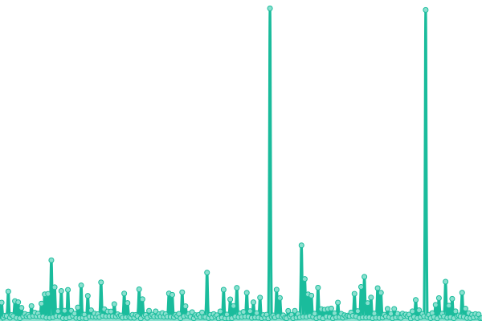
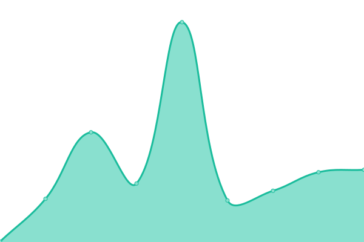

# [📈 Live Status](https://SystemInternal.github.io/uptime): <!--live status--> **🟧 Partial outage**

This repository contains the open-source uptime monitor and status page for [System Inc.](https://www.system.com), powered by [Upptime](https://github.com/upptime/upptime).

With [Upptime](https://upptime.js.org), you can get your own unlimited and free uptime monitor and status page, powered entirely by a GitHub repository. We use [Issues](https://github.com/SystemInternal/uptime/issues) as incident reports, [Actions](https://github.com/SystemInternal/uptime/actions) as uptime monitors, and [Pages](https://SystemInternal.github.io/uptime) for the status page.

<!--start: status pages-->
<!-- This summary is generated by Upptime (https://github.com/upptime/upptime) -->
<!-- Do not edit this manually, your changes will be overwritten -->
<!-- prettier-ignore -->
| URL | Status | History | Response Time | Uptime |
| --- | ------ | ------- | ------------- | ------ |
|  [System.com](https://www.system.com) | 🟩 Up | [system-com.yml](https://github.com/SystemInternal/uptime/commits/HEAD/history/system-com.yml) | 

 158ms
     
 | 

<a href="https://SystemInternal.github.io/uptime/history/system-com">100.00%</a>
    

|  GET Topic Graph | 🟨 Degraded | [get-topic-graph.yml](https://github.com/SystemInternal/uptime/commits/HEAD/history/get-topic-graph.yml) | 

 2028ms
     
 | 

<a href="https://SystemInternal.github.io/uptime/history/get-topic-graph">99.08%</a>
    

|  GET Studies | 🟩 Up | [get-studies.yml](https://github.com/SystemInternal/uptime/commits/HEAD/history/get-studies.yml) | 

 2912ms
     
 | 

<a href="https://SystemInternal.github.io/uptime/history/get-studies">93.75%</a>
    

|  GET Features | 🟩 Up | [get-features.yml](https://github.com/SystemInternal/uptime/commits/HEAD/history/get-features.yml) | 

 4292ms
     
 | 

<a href="https://SystemInternal.github.io/uptime/history/get-features">100.00%</a>
    

|  GET Models | 🟩 Up | [get-models.yml](https://github.com/SystemInternal/uptime/commits/HEAD/history/get-models.yml) | 

 5385ms
     
 | 

<a href="https://SystemInternal.github.io/uptime/history/get-models">99.23%</a>
    

|  GET Datasets | 🟥 Down | [get-datasets.yml](https://github.com/SystemInternal/uptime/commits/HEAD/history/get-datasets.yml) | 

 1192ms
     
 | 

<a href="https://SystemInternal.github.io/uptime/history/get-datasets">98.98%</a>
    

|  GET Topics | 🟩 Up | [get-topics.yml](https://github.com/SystemInternal/uptime/commits/HEAD/history/get-topics.yml) | 

 3121ms
     
 | 

<a href="https://SystemInternal.github.io/uptime/history/get-topics">100.00%</a>
    

|  GET Metrics | 🟩 Up | [get-metrics.yml](https://github.com/SystemInternal/uptime/commits/HEAD/history/get-metrics.yml) | 

 378ms
     
 | 

<a href="https://SystemInternal.github.io/uptime/history/get-metrics">99.66%</a>
    

<!--end: status pages-->

[**Visit our status website →**](https://SystemInternal.github.io/uptime)

## 📄 License

- Powered by: [Upptime](https://github.com/upptime/upptime)
- Code: [MIT](./LICENSE) © [System Inc.](system.com)
- Data in the `./history` directory: [Open Database License](https://opendatacommons.org/licenses/odbl/1-0/)
